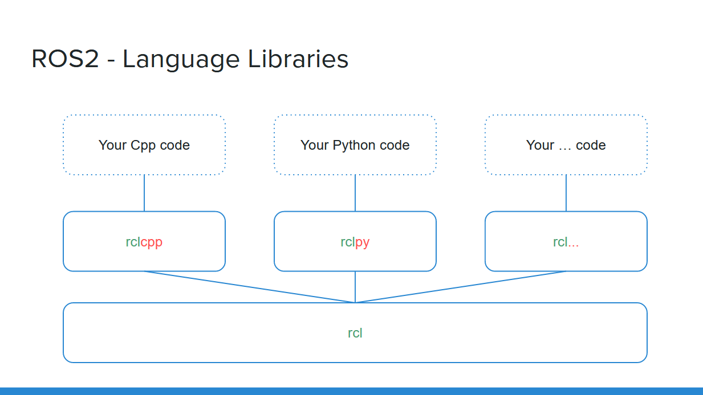

## Steps
- Instalação
  - NOTE: firewall
- Hello World
- Tutorials
  - [Introducing turtlesim and rqt](https://docs.ros.org/en/galactic/Tutorials/Turtlesim/Introducing-Turtlesim.html)
  - [Understanding ROS2 nodes](https://docs.ros.org/en/galactic/Tutorials/Understanding-ROS2-Nodes.html)
  - [Understanding ROS2 Topics](https://docs.ros.org/en/galactic/Tutorials/Topics/Understanding-ROS2-Topics.html)
  - [Understanding ROS2 parameters](https://docs.ros.org/en/galactic/Tutorials/Parameters/Understanding-ROS2-Parameters.html)
  - [Understanding ROS2 Actions](https://docs.ros.org/en/galactic/Tutorials/Understanding-ROS2-Actions.html)


## **Concepts**

### ROS2 Graph
É uma rede de elementos do ROS2 que processa os dados. Ele engloba todos os executáveis ​​e as conexões entre eles se você mapear todos eles e visualizá-los.

### Nodes
Cada node no ROS deve ser responsável por um único propósito. Exemplo: um nó para controlar os motores das rodas, um nó para controlar um laser.

### Topics
Os topics são como um barramento para os nodes trocarem mensagens.
São baseados em publisher-subscriber.


<br/>

Um node pode publicar dados para qualquer número de topics e simultaneamente ter assinaturas para qualquer número de topics.


### Services
Os services são outro método de comunicação entre os nodes. 
São baseados em call-and-response


A vantagem do service é que é uma comunicação bidirecional, pois cliente faz uma solicitação a um node, o service deste node processa a solicitação e envia a resposta para o cliente.

**NOTE:**
<br/>
Para um serviço de chamadas contínua um topic é melhor.


### Parameters
Um parâmetro é um valor de configuração de um node 

## Actions
As actions são um dos tipos de comunicação no ROS2 e destinam-se a tarefas de longa duração. Eles consistem em três partes: um objetivo, feedback e um resultado.
<br/>
As actions são construídas em topics e services. Sua funcionalidade é semelhante aos services, exceto que as actions podem ser canceladas. Eles também fornecem feedback constante, ao contrário de serviços que retornam uma única resposta.


<br/>

Um sistema de robô provavelmente usará actions para navegação. Um objetivo de ação poderia dizer a um robô para viajar para uma posição. Enquanto o robô navega para a posição, ele pode enviar atualizações ao longo do caminho (ou seja, feedback) e, em seguida, uma mensagem de resultado final quando chegar ao seu destino.


## How Create ROS2 Package
Before creating your first node you need to:
- Create a ROS2 workspace and source it.
- Create a (Python/Cpp) package.



<br/>

After writing the node, you compile it, and you re-source your environment in order to use it. Nodes are compiled (only for Cpp), and installed (for both Python and Cpp), inside the install/ folder of your ROS2 workspace. You can directly execute them from here, or by using the command line tool “ros2 run <package> <executable>”.


### Usage
- Turtle
```bash
ros2 run turtlesim turtlesim_node
```

- Execute turtle commands
```bash
ros2 run turtlesim turtle_teleop_key
```

- Show nodes
```bash
rqt_graph
```

- Public command in topic
```bash
ros2 topic pub --once /turtle1/cmd_vel geometry_msgs/msg/Twist "{linear: {x: 2.0, y: 0.0, z: 0.0}, angular: {x: 0.0, y: 0.0, z: 1.8}}"
```

```bash
ros2 topic pub --rate 1 /turtle1/cmd_vel geometry_msgs/msg/Twist "{linear: {x: 2.0, y: 0.0, z: 0.0}, angular: {x: 0.0, y: 0.0, z: 1.8}}"
```

- Alterar a inicialização
```bash
ros2 launch turtlesim multisim.launch.py
```

- Record data from topic
```bash
ros2 bag record <topic_name>
```


- See details from data
```bash
ros2 bag info rosbag2_2022_01_13-06_06_12/

Files:             rosbag2_2022_01_13-06_06_12_0.db3
Bag size:          16.8 KiB
Storage id:        sqlite3
Duration:          12.122s
Start:             Jan 13 2022 06:06:34.766 (1642064794.766)
End:               Jan 13 2022 06:06:46.888 (1642064806.888)
Messages:          13
Topic information: Topic: /turtle1/cmd_vel | Type: geometry_msgs/msg/Twist | Count: 13 | Serialization Format: cdr
```

- Create Python package
```bash
cd $HOME/ros2_ws/src/
ros2 pkg create <my_py_pkg> --build-type ament_python --dependencies rclpy

colcon build --packages-select <my_py_pkg> 
```

- Test package
```bash
ros2 run <my_py_pkg> py_node
```


```bash
```
```bash
```
```bash
```
```bash
```
```bash
```


<br/>

## Referências

---

<p  align="left">
<br/>
<a href="mailto:brunocampos01@gmail.com" target="_blank">
</a>
<a href="https://stackoverflow.com/users/8329698/bruno-campos" target="_blank">
</a>
<a href="https://www.linkedin.com/in/brunocampos01" target="_blank"></a>
<a href="https://github.com/brunocampos01" target="_blank"></a>
<a href="https://brunocampos01.netlify.app/" target="_blank">
</a>
<a href="https://medium.com/@brunocampos01" target="_blank">
</a>
<a rel="license" href="http://creativecommons.org/licenses/by-sa/4.0/"></a><br/>
</p>
